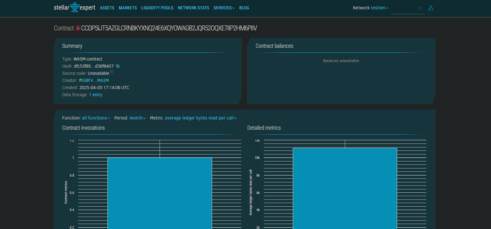

# Rent Payment Automation Smart Contract

## Project Title
Rent Payment Automation

## Project Description
A decentralized application (dApp) built on the Stellar blockchain that facilitates the leasing of physical or digital assets. The smart contract enables asset owners to lease their items in exchange for Lumens (XLM), with automated handling of lease terms, payment processing, and scheduled returns.

## Contract Address Details: 
CCDP5IJT5AZGLCRNBKYXNQ24E6XQYOWAGB2JQR52OQXE7IIP2HM6PIIV

## Project Vision
The Rent Payment Automation smart contract aims to revolutionize the traditional leasing industry by eliminating intermediaries, reducing paperwork, and increasing transparency. By leveraging blockchain technology, we can create trustless leasing agreements where all terms are enforced programmatically, payments are processed automatically, and the history of all transactions is immutably recorded.

The vision is to create a global, decentralized marketplace where anyone can lease their assets securely without geographical limitations, currency conversion issues, or concerns about contract enforcement. This system will make leasing more accessible, efficient, and cost-effective for both lessors and lessees.

## Key Features

### Asset Registration
- Asset owners can register physical or digital assets with detailed descriptions
- Each asset receives a unique identifier on the blockchain
- Support for adding metadata such as images, condition reports, and valuation
- Customizable lease terms including duration options and pricing

### Smart Lease Agreements
- Programmatically enforced lease contracts with clear terms
- Automatic tracking of lease start and end dates
- Support for security deposits with conditional release
- Grace periods for late payments configurable by asset owner

### Automated Payment Processing
- Scheduled recurring payments in XLM
- Late payment detection with optional penalty fees
- Early termination options with predefined conditions
- Partial payment support with balance tracking

### Lease Lifecycle Management
- Clear visibility of active, pending, and completed leases
- Automatic notifications of upcoming lease expiration
- Extension and renewal options
- Dispute resolution mechanism

### Security and Compliance
- Multi-signature requirements for high-value assets
- Optional KYC integration for regulated assets
- Escrow services for valuable items
- Compliance with relevant regulatory requirements

### Reporting and Analytics
- Transaction history for all lease activities
- Performance metrics for asset utilization
- Income reporting for tax purposes
- Market rate comparisons for similar assets